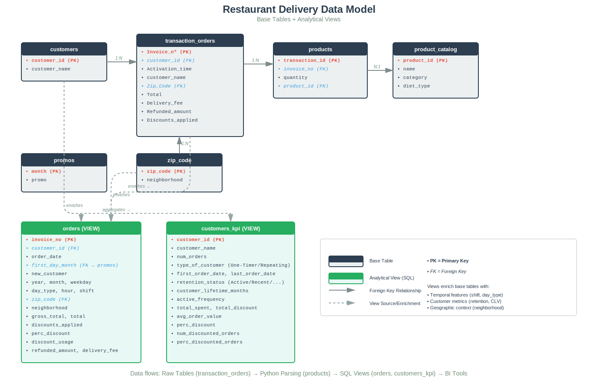
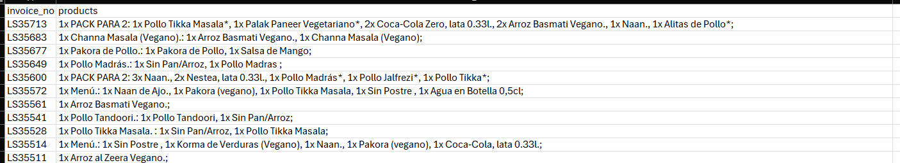
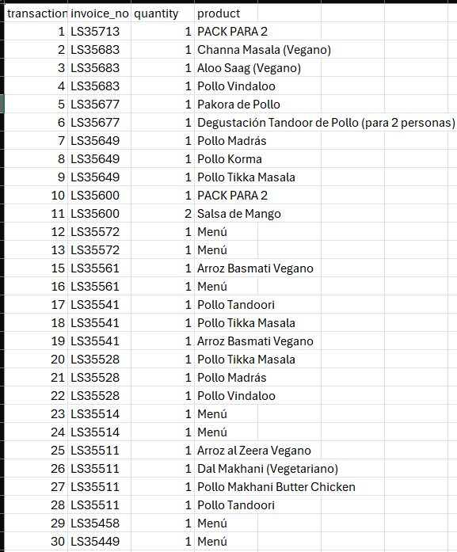

# 🍽️ Restaurant Delivery Data Cleaning Pipeline
**Excel → Python → SQL Server**

Transformed 4,184 messy delivery orders into analysis-ready datasets. Parsed unstructured product text, anonymized 1,805 customers, and built reusable KPI views for BI tools.
---
# 🍽️ Restaurant Delivery Data Cleaning Pipeline

I built this pipeline to transform 4,184 messy delivery orders from Last App 
into analysis-ready datasets. The challenge: all products were buried in one 
text field, customers weren't anonymized, and timestamps were inconsistent. 

My solution uses Python regex to parse product text, Excel to anonymize PII, 
and SQL views to create a reusable semantic layer. The result powers two 
downstream BI projects analyzing sales trends, customer retention, and 
discount effectiveness.

---

## 📊 Project Overview

| Metric | Result |
|--------|--------|
| **Orders processed** | 4,184 |
| **Customers anonymized** | 1,805 |
| **Products enriched** | 114 menu items |
| **Date range** | 2023-01-01 to 2024-12-31 |
| **Revenue reconciliation** | 87.5% match (known platform export limitation) |

**Downstream use:** Powers [Power BI Sales Dashboard] and [Tableau Customer Analytics]

---

## 🎯 The Problem

Raw exports from Last App delivery platform were unusable for analysis:

### Issue 1: Unstructured Product Data
Each order had ALL items in one text field:

```
LS35713 | 1x PACK PARA 2: 1x Pollo Tikka Masala*, 1x Palak Paneer*; 
         2x Coca-Cola Zero, lata 0.33l.; 1x Naan.; 1x Alitas de Pollo*
```

**Impact:** No way to analyze product mix, category performance, or item-level trends.

### Issue 2: Customer PII Exposed
Phone numbers, emails, and addresses in plain text.

### Issue 3: Missing Dimensions
No customer ID, no product attributes (category/diet type), non-standard timestamps.

---

## ⚙️ The Solution: 3-Phase Pipeline

```
📊 Excel               →  🐍 Python              →  🗄️ SQL Server
─────────────────────────────────────────────────────────────────
• Standardize dates       • Regex text parsing     • Normalized tables
• Anonymize customers     • Extract quantities     • Feature engineering
• Extract ZIP codes       • Clean product names    • Analytical views
• Remove PII              • 1 row per item         • KPI semantic layer
```

---

## 📁 Repository Structure

```
01_data_cleaning_pipeline/
├── Excel/
│   ├── cleaning_steps.md              ← Detailed Excel methodology
│   ├── customers_sample.csv           ← Anonymized dimension (50 records)
│   ├── orders_raw_main_source_file.csv
│   └── products_catalog_sample.csv
├── Python/
│   ├── clean_products.py              ⭐ Text parsing script
│   ├── requirement.txt                  (pandas, regex)
│   └── sample_clean_products.csv      ← Output: 1 row per product
├── SQL/
│   ├── 01_views.sql                   ⭐ orders & customers_kpi views
│   └── 02_data_quality_checks.sql     ⭐ 7 validation queries
├── screenshots/
│   ├── orders_with_products_text.png  ← Before parsing
│   └── clean_products.png             ← After parsing
└── README.md
```

---

## 🔬 Technical Deep Dive

### Phase 1: Excel Cleaning & Anonymization

**Key transformations:**

1. **Timestamp Selection**
   - Chose `activation_time` (kitchen receipt) over `creation_time` (scheduled orders misplaced)
   - Rejected `estimated_delivery_time` (artificial +28min default)

2. **Customer Anonymization**
   - Phone number was only unique identifier
   - Created synthetic `customer_id` (C0001, C0002...)
   - Removed all PII: phone, email, full address
   - Result: 1,805 unique customers mapped

3. **ZIP Code Extraction**
   - Used Flash Fill to extract `08025` from `"Nombre Calle 123, 08025 Barcelona, Espagne"`
   - Enabled geographic segmentation via neighborhood lookup

**📄 Full methodology:** [Excel/cleaning_steps.md](Excel/cleaning_steps.md)

---

### Phase 2: Python Product Parsing ⭐

**Challenge:** Parse complex nested product strings like:
```
1x PACK PARA 2: 1x Pollo Tikka Masala*, 1x Palak Paneer*
```

**Solution:** Regex-based parser with modifier stripping

<details>
<summary><b>🐍 View Python parsing logic (click to expand)</b></summary>

```python
"""
Cleans unstructured product text from Last App exports.
Handles nested packs, quantities, and modifiers.
"""

import pandas as pd
import re

df = pd.read_excel("products.xlsx")
clean_rows = []

for _, row in df.iterrows():
    invoice_no = row["invoice_no"]
    raw_text = str(row["products"])
    
    # Split by semicolon to separate products
    products = [p.strip() for p in raw_text.split(";") if p.strip()]
    
    for product in products:
        # Remove modifiers (everything after ":")
        # "1x Samosa.: 1x Sin Salsa Extra" → "1x Samosa."
        product = product.split(":")[0].strip()
        
        # Extract quantity: "2x Coca-Cola" → qty=2, name="Coca-Cola"
        match = re.match(r"(\d+)x\s*(.*)", product)
        if match:
            quantity = int(match.group(1))
            product_name = match.group(2)
        else:
            quantity = 1
            product_name = product
        
        # Clean: remove dots, asterisks, quotes
        product_name = re.sub(r"[\*\.\"]", "", product_name).strip()
        
        clean_rows.append({
            "invoice_no": invoice_no,
            "quantity": quantity,
            "product": product_name
        })

# Create DataFrame with transaction IDs
clean_df = pd.DataFrame(clean_rows)
clean_df.reset_index(inplace=True)
clean_df.rename(columns={"index": "transaction_id"}, inplace=True)
clean_df["transaction_id"] = clean_df["transaction_id"] + 1

clean_df.to_csv("clean_products.csv", index=False, encoding="utf-8-sig")
print(f"✅ Parsed {len(clean_df)} product lines from {len(df)} orders")
```

</details>

**Results:**
- Successfully parsed majority of orders
- Some products truncated due to Excel cell length limits (platform export issue)
- Output: `transaction_id | invoice_no | quantity | product_name`

**📄 Full script:** [Python/clean_products.py](Python/clean_products.py)

---

### Phase 3: SQL Data Modeling & KPI Views ⭐

Built normalized schema + semantic layer for consistent BI metrics.

#### **View 1: `orders` - Enriched Transaction Dataset**

Transforms raw orders into analysis-ready records with temporal, geographic, and financial features.

**Key features added:**

```sql
-- 1. Customer Classification
CASE 
    WHEN order_date = first_order_date THEN 'Yes'
    ELSE 'No'
END AS new_customer

-- 2. Temporal Segmentation
CASE 
    WHEN DATEPART(HOUR, Activation_time) < 16 THEN 'Morning'
    WHEN DATEPART(HOUR, Activation_time) < 20 THEN 'Afternoon'
    ELSE 'Night'
END AS shift

-- 3. Financial Standardization (cents → euros)
ROUND((Total + Discounts_applied)/100, 2) AS gross_total
ROUND(Discounts_applied / 100, 2) AS discounts_applied

-- 4. Discount Percentage (with zero-division guard)
ROUND(
    COALESCE(
        NULLIF(Discounts_applied/100, 0) /
        NULLIF((Total + Discounts_applied)/100, 0) * 100, 
    0), 
2) AS perc_discount
```

**Business value:**
- Enables new vs. returning customer acquisition analysis
- Supports time-pattern insights (best days/hours for sales)
- Powers discount effectiveness tracking
- Geographic performance segmentation

---

#### **View 2: `customers_kpi` - Aggregated Customer Metrics**

Customer-level KPIs for retention and lifetime value analysis (2023-2024 period).

**Key metrics:**

```sql
-- Retention Status (based on recency vs. 2024-12-31)
CASE 
    WHEN DATEDIFF(DAY, last_order_date, '2024-12-31') <= 30 THEN 'Active'
    WHEN DATEDIFF(DAY, last_order_date, '2024-12-31') <= 60 THEN 'Recent'
    WHEN DATEDIFF(DAY, last_order_date, '2024-12-31') <= 180 THEN 'Sleeping'
    ELSE 'Inactive'
END AS retention_status

-- Active Frequency (orders per active month)
ROUND(
    num_orders / NULLIF(
        ROUND(CAST(DATEDIFF(DAY, first_order_date, last_order_date) AS FLOAT) / 30, 1),
    0),
1) AS active_frequency

-- Discount Behavior
ROUND(num_discounted_orders / CAST(num_orders AS FLOAT) * 100, 0) AS perc_discounted_orders
```

**Business value:**
- Identifies one-timers vs. repeat buyers
- Tracks churn risk by retention status
- Reveals spending patterns and AOV by segment
- Measures discount dependency

**📄 Full SQL definitions:** [SQL/01_views.sql](SQL/01_views.sql)

---
## 📊 Data Model

The pipeline creates a normalized schema with analytical views:



**Base tables** (gray) store raw/cleaned data. **Analytical views** (green) add business logic and KPIs for BI tools.

---

## ✅ Data Quality & Validation

### Automated Quality Checks

Created 7 validation queries to ensure pipeline integrity:

<details>
<summary><b>🔍 View data quality checks (click to expand)</b></summary>

```sql
-- 1. Date Coverage Validation
SELECT MIN(order_date) AS min_date, MAX(order_date) AS max_date
FROM orders;

-- 2. Row Count Consistency (no rows lost in views)
SELECT 
    (SELECT COUNT(*) FROM dbo.transaction_orders) AS raw_orders,
    (SELECT COUNT(*) FROM orders) AS view_orders;

-- 3. Financial Integrity (gross_total = total + discounts)
SELECT * FROM orders
WHERE ABS(gross_total - (total + discounts_applied)) > 0.01;

-- 4. Missing Customer IDs
SELECT * FROM orders WHERE customer_id IS NULL;

-- 5. Missing Invoice Numbers
SELECT * FROM orders WHERE invoice_no IS NULL;

-- 6. Unmatched ZIP Codes
SELECT * FROM orders WHERE neighborhood IS NULL;

-- 7. Discount Logic Validation
SELECT * FROM orders
WHERE discounts_applied > 0 AND discount_usage <> 'Yes';
```

</details>

**📄 Run validations:** [SQL/02_data_quality_checks.sql](SQL/02_data_quality_checks.sql)

---

### Known Limitations & Transparency

This project documents all data quality issues for stakeholder transparency:

| Issue | Impact | Mitigation |
|-------|--------|------------|
| **Product text truncation** | Some large orders have incomplete item lists | Excel cell length limit from platform export |
| **Missing paid modifiers** | "Extra cheese" not captured in product text | Platform export doesn't include granular customizations |
| **Revenue reconciliation gap** | 25K difference on 200K gross total (12.5%) | Acceptable for exploratory analysis; not for financial reporting |
| **Product parsing incomplete** | Cannot quantify exact parse success rate | Cell truncation prevents full validation |

**Recommendation:** This dataset is suitable for trend analysis, customer segmentation, and operational insights. For precise financial reporting, use platform's native revenue reports.

---

## 📸 Visual Proof

### Before: Messy Product Text

*All items concatenated in one cell with modifiers and packs*

### After: Clean Tabular Format

*One product per row with quantities extracted*

---

## 🚀 How to Use

### ⚠️ Data Privacy Notice
This repository contains **sample data only** (50 orders) to demonstrate methodology while protecting customer privacy. Full production dataset contains PII and is not publicly available.

### Prerequisites
```bash
Python 3.8+
SQL Server 2019+ (or any SQL dialect with window functions)
Libraries: pandas, regex
```

### Quick Start

```bash
# 1. Parse sample product data
cd Python/
pip install -r requirement.txt
python clean_products.py --input orders_with_products_text_sample.csv

# 2. Review SQL views (adapt to your schema)
cat SQL/01_views.sql

# 3. Run data quality checks
sqlcmd -S your_server -d your_db -i SQL/02_data_quality_checks.sql
```

---

## 💼 Business Impact

This cleaned dataset enables:

### 📈 Sales Analytics
- Trend analysis by day/week/month
- Peak hour identification (Morning/Afternoon/Night shifts)
- Weekend vs. weekday performance
- Geographic segmentation by neighborhood

### 👥 Customer Intelligence
- New vs. returning customer acquisition
- Retention status tracking (Active → Recent → Sleeping → Inactive)
- Customer lifetime value (CLV) estimation
- Repeat purchase frequency analysis

### 💰 Financial Insights
- Discount effectiveness measurement
- Margin impact of promotions
- Average order value (AOV) by segment
- Delivery fee analysis

### 🍕 Product Optimization
- Best-selling items identification
- Category performance (via enriched product catalog)
- Menu mix analysis
- Diet type demand (vegetarian/vegan tracking)

---

## 🛠️ Tech Stack


---

## 🎓 Key Takeaways

**What I learned building this pipeline:**

1. **Data privacy first** - Always anonymize before analysis
2. **Regex is powerful** - Complex text parsing becomes manageable with proper patterns
3. **Defensive SQL** - `NULLIF` and `COALESCE` prevent division-by-zero errors
4. **Documentation matters** - Transparent limitations build trust with stakeholders
5. **Semantic layers work** - Views eliminate metric inconsistency across reports

---

## 📧 Questions?

See detailed documentation in each folder:
- [Excel/cleaning_steps.md](Excel/cleaning_steps.md) - Full Excel methodology
- [Python/clean_products.py](Python/clean_products.py) - Parsing script with comments
- [SQL/01_views.sql](SQL/01_views.sql) - View definitions with business logic

---

**Next in series:**  
→ [Project 2: SQL + Power BI Insights Dashboard]  
→ [Project 3: Tableau Customer Analytics]