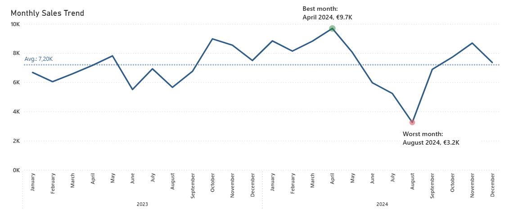
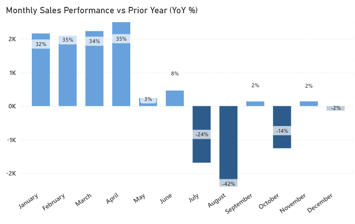
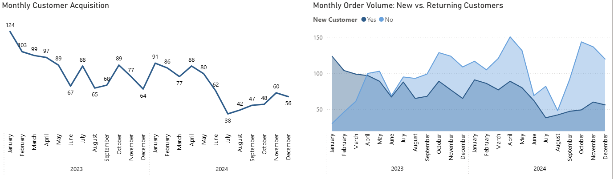
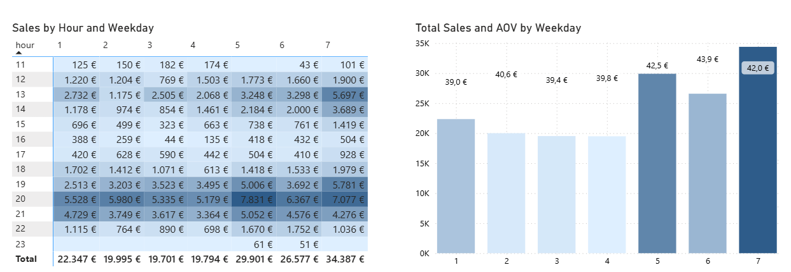
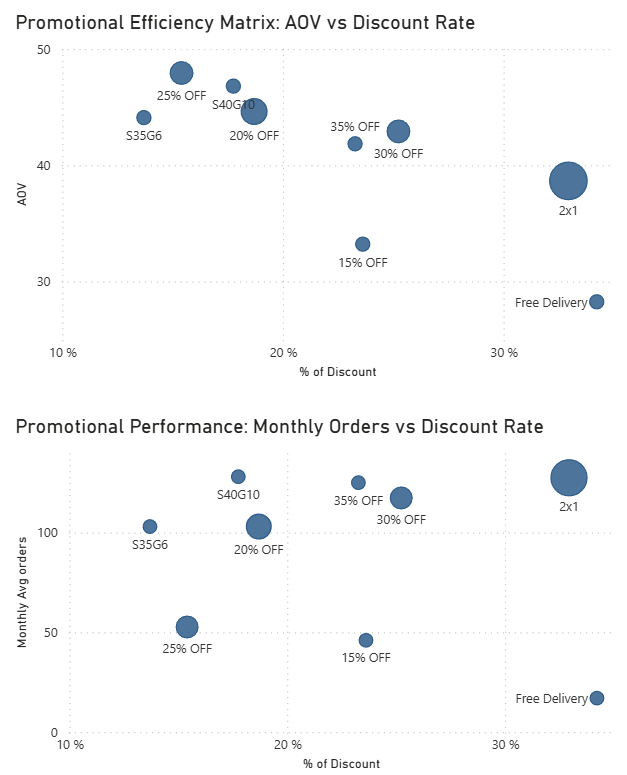

# 📊 Restaurant Sales Intelligence
**SQL -> Power Bi**
---

## 🎯 Project Overview

Conducted comprehensive SQL analysis to uncover insights on sales trends, customer retention, and promotional effectiveness for a Barcelona-based Indian restaurant's delivery operations. Analyzed 24 months of transaction data (4,184 orders, 1,809 customers) from Last App delivery platform. Built Power BI visualizations to support the analytical narrative, illustrating customer lifecycle patterns, operational trends, and promotional performance to communicate key findings and recommendations.

---

## 📍 Client Background

The client is a well-established Indian restaurant in Barcelona, renowned for its authentic cuisine and distinctive ambiance. After years of success as a dine-in destination, the restaurant launched delivery operations in mid-2022 through Last App, a third-party delivery platform that manages order processing and customer data.

**Business Context:**
- **Launch:** Mid-2022 (delivery operations)
- **Analysis Period:** 2023-2024 (first two full years of delivery data)
- **Platform:** Last App (handles order management, customer data, payment processing)
- **Challenge:** Limited analytical capabilities within Last App's native reporting—basic revenue and order counts only, with no visibility into customer behavior, retention patterns, or promotional ROI

This analysis addresses the platform's limitations by transforming raw order exports into a comprehensive business intelligence framework.

---

## 🎯 North Star Metrics

### **Sales Performance & Growth Trends**
Analyzing revenue trajectory, order volume, customer acquisition rates, and average order value to assess business health and identify growth drivers vs. warning signals.

### **Customer Retention & Lifetime Value**
Evaluating first-order retention rates, churn patterns across customer lifecycle stages, and lifetime value gaps between one-time and repeat customers to quantify retention opportunities.

### **Operational Efficiency**
Examining revenue distribution across day-parts (morning/afternoon/night), weekday vs. weekend performance, and seasonal patterns to optimize staffing and promotional timing.

### **Discount Strategy & Promotional Effectiveness**
Assessing promotional ROI across different discount types (percentage-based, BOGO, spend thresholds), measuring impact on basket size and customer behavior, and identifying margin erosion from over-discounting.

---

## 📊 Executive Summary

### **Key Findings**

**The Retention Crisis (Primary Issue)**
- **65% of customers never return after their first order**, representing a critical onboarding failure
- However, customers who make a second order show **60% likelihood of making a third**, indicating the first-order experience is the primary leak
- Repeating customers are worth **4.5x more** than one-timers (€192.86 vs €43.00 lifetime value)
- **85% of the customer base is inactive or sleeping**, requiring immediate intervention

**The Discount Trap (Secondary Issue)**
- Discounts **don't increase basket size**: €41.5 avg ticket with discount vs €41.0 without (1.2% meaningless lift)
- **59% of all orders use discounts**—both new customers (62%) and repeat customers (59%) show identical dependency
- Restaurant is **over-discounting by €11.7K annually** (17.6% rate vs 10-12% industry benchmark)
- **Hidden winner identified:** SXGY promos (Spend €35 Get €5) drive €44-47 average orders with highest adoption rates, outperforming blanket percentage discounts 3:1

**The Acquisition Decline (Emerging Risk)**
- **New customer acquisition dropped 24.7%** (from 1,032 in 2023 to 777 in 2024)
- Revenue growth of +5.4% is **fragile**: driven entirely by €2.10 higher ticket prices, not volume (+4 orders only)
- Revenue mix shifted from 51% new/49% returning (2023) to 36% new/64% returning (2024), creating **future revenue risk** as smaller 2024 cohort matures
- August 2024 crashed -42.5% YoY due to structural seasonality weakness combined with ineffective promotional strategy

 Metric | Value |
|--------|-------|
| **Revenue Growth** | +5.4% YoY |
| **First-Order Churn** | 65% |
| **New Customer Acquisition** | -24.7% YoY |
| **Discount Rate** | 17.6% |
| **Customer Base Health** | 85% inactive/sleeping |

**Implication:** Growth depends entirely on pricing power, which plateaus. Without volume growth, one weak quarter erases gains. (See Executive Summary for strategic impact.)

### 💰 Financial Impact Summary

| Issue | Annual Cost | Root Cause | Recommended Fix |
|-------|-------------|------------|-----------------|
| **First-order churn** | €40,000 lost LTV | Onboarding failure (65% never return) | Milestone loyalty program |
| **Discount inefficiency** | €11,704 margin erosion | 17.6% rate vs 10% benchmark | SXGY permanent + eliminate weekend blanket discounts |
| **Dormant customers** | €146,800 inactive LTV | 85% sleeping/inactive | Email/SMS reactivation (5% = €7.4K) |

**Total Addressable Opportunity:** €25-30K annually (conservative estimate)

### **Strategic Recommendations**

**Build Brand Trust Beyond Discounts**
Shift marketing focus from discount-led promotions to experience-driven content that showcases the restaurant's authentic cuisine. Introduce non-discount value adds and train customers to order based on quality, not deal availability.

**Launch Milestone Loyalty Program**
Implement a simple milestone program where customers unlock 50% off after completing 5 orders. This creates psychological momentum during the critical retention window (orders 2-5) and trains customers to value earning rewards rather than waiting for the next blanket promotion.

**Restructure Discount Strategy (3-Tier Model)**
(1) Make SXGY promos permanent fixtures (drives €44-47 baskets vs €41 baseline with best ROI), (2) Reserve 25-30% discounts for first orders only as acquisition tools, (3) Deploy 2x1 promos tactically on Wednesdays and during summer slumps to smooth demand. Eliminate weekend blanket discounts where customers already demonstrate higher willingness to pay.

**Reactivate Dormant Customers**
Launch personalized email and SMS campaigns targeting 1,537 sleeping and inactive customers with time-limited offers (20-25% off). 

---

### **📊 Continue to [Detailed Analysis](#-analysis-structure) below, or jump to [Technical Appendix](#-technical-appendix) for SQL methodology and data validation.**
---

## 📖 Analysis Structure

### **Four Core Questions Investigated**

**[Chapter 1: Business Health Check](#-chapter-1-business-health-check)**  
*"Is growth real or an illusion?"*  
→ Revenue +5.4%, but volume flat. Growth is ticket-driven, not customer-driven.

**[Chapter 2: The Retention Crisis](#-chapter-2-the-retention-crisis)**  
*"Why do 65% of customers never return?"*  
→ Onboarding failure costs €40-50K annually. But survivors show promise.

**[Chapter 3: Operational Performance](#-chapter-3-operational-performance)**  
*"Where is the business strongest?"*  
→ Night shift = 47% of revenue. Weekdays drive volume, weekends drive value.

**[Chapter 4: Discount Strategy Analysis](#-chapter-4-discount-strategy-analysis)**  
*"Are promotions helping or hurting?"*  
→ Discounts don't increase spend. SXGY promos outperform blanket discounts 3:1.

**[Strategic Implementation Details](#-strategic-recommendations)**  
*"How do we fix these issues?"*  
→ Deep-dive on the 4 recommended actions with implementation roadmap.

---

# 📘 Chapter 1: Business Health Check

## **"Growing Revenue, Shrinking Customer Base"**

### 1.1 Overall Performance (2023-2024)

| Metric | 2-Year Total | 2024 | 2023 | YoY Change |
|--------|--------------|------|------|------------|
| **Net Sales** | €172,703 | €88,609 | €84,093 | +5.4% ✅ |
| **Gross Sales** | €209,511 | €107,252 | €102,259 | +4.9% ✅ |
| **Total Orders** | 4,184 | 2,094 | 2,090 | +0.2% ⚠️ |
| **Unique Customers** | 1,809 | 777 | 1,032 | -24.7% 🔴 |
| **Avg Ticket** | €41.3 | €42.3 | €40.2 | +5.2% ✅ |
| **Discount Rate** | 17.6% | 17.4% | 17.8% | -0.4pp ✅ |

**🔥 Key Finding #1: Fragile Growth Model**

Revenue grew 5.4% but **only 4 additional orders** were placed. Entire growth came from €2.10 higher average ticket, not from more customers or more transactions.

**What This Means:**
- Ticket inflation has limits (price elasticity ceiling)
- No volume growth = no customer base expansion
- One bad quarter could erase all gains
- 2025 revenue at risk if 2024's smaller cohort doesn't mature

---

### 1.2 Monthly Performance: The August Collapse

**2024 vs 2023 Monthly Trend Overview:**

The year started strong with consistent outperformance through June:
- **Jan-Apr 2024:** Exceptional growth (+32-35% YoY) - strongest period of the entire dataset
- **May-Jun 2024:** Modest gains, staying slightly above 2023 levels
- **July 2024 onwards:** The trend reversed dramatically, with July marking the beginning of sustained underperformance

This shift from consistent growth to decline mid-year signals a fundamental change in business dynamics that requires investigation.

**Best Months:**
- April 2024: €9,687 (+35.3% YoY) ⭐
- March 2024: €8,815 (+34.0% YoY)
- February 2024: €8,136 (+34.7% YoY)
- January 2024: €8,835 (+32.4% YoY)

**Worst Months:**
- August 2024: €3,251 (-42.5% YoY) 🔴
- July 2024: €5,234 (-24.4% YoY)

---
### 1.3 The Revenue Mix Shift

**2023:** 51% new customers / 49% returning (balanced)  
**2024:** 36% new customers / 64% returning (retention-heavy)

**Translation:**
- Lost €10.6K in new customer revenue
- Gained €15.1K in returning customer revenue
- Net gain: +€4.5K (the 5.4% growth)

**The Problem:**  
This looks like retention success but masks an acquisition crisis. Without new customers, the base shrinks in 2025.

**Analogy:** You're keeping current customers happy, but the funnel is drying up. In 12 months, you'll have fewer returning customers from 2024's smaller cohort.

---
### 1.4 The Acquisition Crisis

| Year | New Customers | Change |
|------|---------------|--------|
| 2023 | 1,032 | - |
| 2024 | 777 | **-24.7%** 🔴 |

**Financial Impact:**
- 255 customers × €43 first order = **€10,965 immediate revenue lost**
- 255 customers × €95.72 avg LTV = **€24,409 lifetime value lost**

**The Burning Platform:** Without fixing retention, even strong acquisition only yields 35% efficiency. But acquisition is declining, creating compounding crisis.

---

### 1.5 Margin Pressure

**Discount Rate: 17.6% of gross revenue**
- Total discounts given: €36,808
- Industry benchmark: 10-12%
- **Excess cost: €11,704 annually**

**Positive signal:** Rate improved from 17.8% (2023) to 17.4% (2024), showing restaurant is attempting to reduce dependency. But still 47% above healthy levels.

---

# 📗 Chapter 2: The Retention Crisis

## **"65% Never Return—But Survivors Show Promise"**

### 2.1 The Retention Disaster

| Metric | Value | Benchmark | Gap |
|--------|-------|-----------|-----|
| **Retention Rate** | 35% | 60-70% | -30pp 🔴 |
| **One-Timers** | 1,170 (65%) | 30-40% | +25pp 🔴 |
| **Avg Lifetime** | 2.82 months | 12-18 months | -10 months |
| **Avg Orders per Customer** | 2.32 | 5-7 | -3 orders |

*Benchmarks: Food delivery industry (DoorDash, Uber Eats studies)*

---

### 2.2 The Churn Cascade

**🔥 Key Finding #5: The First-Order Cliff**

| Order # | Customers | % of Base | Drop from Previous |
|---------|-----------|-----------|-------------------|
| **1** | 1,805 | 100% | - |
| **2** | 635 | 35% | **-65%** 🔴 |
| **3** | 378 | 21% | **-40%** |
| **4-5** | 437 | 24% | -15-25% (stabilizing) |
| **6+** | 353 | 20% | Loyal base |

**The Story:**
1. **65% never return after first order** (the onboarding cliff)
2. **Of the 35% who return, 60% make order 3** (positive signal!)
3. **After order 3, retention stabilizes** (15-25% churn per order)

**Critical Insight:**  
First cliff (65%) is the killer. But customers who cross it are worth targeting—60% make order 3. **Focus: convert one-timers → two-timers.**

---

### 2.3 Lifetime Value Analysis

| Segment | Customers | Avg LTV | Avg Orders |
|---------|-----------|---------|------------|
| **One-Timer** | 1,170 (65%) | €43.00 | 1.00 |
| **Repeating** | 639 (35%) | €192.86 | 4.75 |

**Repeating customers worth 4.5x more.**

---

### 2.4 The Discount Trap

**🔥 Key Finding #7: Discounts Don't Create Loyalty**

| Customer Type | Total Orders | % Using Discount |
|---------------|--------------|------------------|
| **One-Timers** | 1,170 | 62% |
| **Repeating** | 3,014 | 59% |
| **Difference** | - | **3pp** (meaningless) |

**What This Proves:**
- Discounts attract first-time customers (62% use them)
- But don't reduce dependency for repeaters (59% still use)
- **We've trained customers to wait for discounts**

**The Loyalty Paradox:**  
We hoped: "Discount → trial → love food → return at full price"  
Reality: "Discount → trial → love food → **wait for next discount**"

---

### 2.5 Customer Base Health

**Retention Status (as of Dec 2024):**

| Status | Customers | % | Days Inactive |
|--------|-----------|---|---------------|
| **Active** | 146 | 8.1% | <30 |
| **Recent** | 126 | 7.0% | 30-60 |
| **Sleeping** | 255 | 14.1% | 60-180 |
| **Inactive** | 1,282 | 70.9% | >180 |

**85% of customers require intervention.** Only 15% are active/recent.

---

# 📙 Chapter 3: Operational Performance

## **"Night Shift = 47%, Weekdays Drive Volume"**

### 3.1 Revenue by Time of Day

| Shift | Sales | % | Avg Ticket | Orders |
|-------|-------|---|------------|--------|
| **Night (8PM+)** | €80,694 | 46.7% | €39.75 | 2,030 |
| **Afternoon** | €43,043 | 24.9% | €43.74 ⭐ | 984 |
| **Morning** | €48,965 | 28.4% | €41.85 | 1,170 |

**🔥 Key Finding #9:** Night shift is core business (47% of revenue). Afternoon has highest avg ticket (€43.74) = premium ordering window.

---
### 3.2 Day-of-Week Analysis

**Best Performing Days:**
- **Sunday:** Highest revenue (€34,387) and avg ticket (€42) - strongest single day
- **Friday:** Second highest revenue (€29,901), peak dinner demand
- **Saturday:** Strong weekend performance (€26,577)

**Weakest Performing Days:**
- **Wednesday:** Lowest revenue (€19,701) and avg ticket (€40) 🔴
- **Tuesday:** Second weakest (€19,995), tied with Wednesday for mid-week slump
- **Thursday:** Third weakest (€19,794), just below Tuesday

**Strategic Implication:**  
Mid-week (Tuesday-Thursday) shows consistent underperformance with ~€20K revenue vs ~€30K on peak days. **Wednesday represents the clearest opportunity** for tactical promotions (e.g., 2x1 offers) to smooth weekly demand and boost the weakest day by 30-40%, potentially adding €6-8K in weekly revenue.

---

### 3.3 Weekday vs Weekend

| Day Type | Sales | % | Avg Ticket | Discount Rate |
|----------|-------|---|------------|---------------|
| **Weekday** | €111,738 | 64.7% | €40.50 | 16.17% |
| **Weekend** | €60,964 | 35.3% | €42.78 | 16.31% |

**🔥 Key Finding #10:** Weekdays drive volume (65%), weekends drive value (+5.6% higher ticket).

**Strategic Insight:**  
Weekend customers willing to pay more BUT discount usage identical (16.3% vs 16.17%). **Missed opportunity to reduce weekend promos.**

**Hypothesis:** Reduce weekend discounts 16% → 10% without losing volume (test recommended).

---

### 3.3 Seasonality

**Strong:** Oct-May (except Christmas week)  
**Weak:** June-August (summer)

**Insight:** Accept summer decline as structural. Maximize Q1 & Q4 with aggressive acquisition campaigns.

---

# 📕 Chapter 4: Discount Strategy Analysis

## **"SXGY Promos Outperform 3:1, Blanket Discounts Fail"**

### 4.1 The Discount Problem

| Metric | Value |
|--------|-------|
| **Orders with discount** | 2,488 (59%) |
| **Avg ticket WITH discount** | €41.5 |
| **Avg ticket WITHOUT discount** | €41.0 |
| **Difference** | €0.5 (1.2%) |

**🔥 Key Finding #11: Discounts Don't Increase Basket Size**

1.2% lift is meaningless. Discounts are pure margin erosion with no behavioral change.

**Industry Context:**
- Healthy rate: 10-12%
- This restaurant: 17.6%
- **Excess cost: €11,704 annually**

---

### 4.2 Promo Performance

**🔥 Key Finding #12: SXGY Promos Are Hidden Winners**

| Promo | Monthly Avg | AOV | Discount % | Revenue/€ Discounted |
|-------|-------------|-----|------------|---------------------|
| **S35G5** | €4,542 | €44.1 | 14% | **€6.3** ⭐⭐⭐ |
| **S40G10** | €5,991 | €46.8 | 18% | **€4.6** ⭐⭐ |
| **25% OFF** | €2,524 | €47.9 | 15% | €5.5 |
| **20% OFF** | €4,596 | €44.6 | 19% | €4.3 |
| **2x1** | €4,926 | €38.7 | 33% | €2.0 |
| **30% OFF** | €5,034 | €42.9 | 25% | €3.0 |
| **Free Delivery** | €480 | €28.3 | 34% | €1.9 🔴 |

**Why SXGY Wins:**
- **S35G5:** Customers spend €44 (€9 above €35 threshold!) with 75.7% adoption
- **S40G10:** Customers spend €46.8 (€6.8 above €40 threshold!) with 73.6% adoption
- Creates upselling motivation (add items to hit threshold)
- Rewards high spenders vs blanket discounts

**The 2x1 Paradox:**
- Most used (9 months), highest volume (€4.9K avg)
- But: Lowest AOV (€38.7), highest discount % (33%), worst ROI (€2.0)
- **Strategic use:** Volume driver for weak days/seasons, NOT margin optimizer

The scatter plots below reveal promotional efficiency across two dimensions:

- **Efficiency View: AOV vs Discount Rate**
- **Volume View: Monthly Orders vs Discount Rate**

**Insight:** SXGY promos (top-left quadrant) deliver €44-47 AOV with only 14-18% discount rate—ideal positioning.

---

### 4.3 Discount Dependency

**🔥 Key Finding #13: Both Segments Are Discount Addicts**

One-timers: 62% use discounts  
Repeating: 59% use discounts  
**Difference: 3pp (meaningless)**

We've trained customers to never pay full price.

---

# 🎯 Strategic Recommendations

## **Priority-Ranked Action Plan**

---

### 1. Build Brand Trust Beyond Discounts

**The Problem:**  
Constant discounting trains customers to wait for deals rather than order based on quality and experience. The restaurant's unique value—authentic cuisine and traditional Indian ambiance—is overshadowed by promotional messaging.

**The Solution:**  
Shift marketing focus from discount-led campaigns to experience-driven content. Showcase the decorated space, chef's specialties, and authentic cultural elements. Introduce non-discount value adds like complimentary appetizer samples or cultural storytelling about signature dishes.

**Goal:** Train customers to associate the brand with quality and experience, not just the next deal.

---

### 2. Launch Milestone Loyalty Program

**The Problem:**  
65% of customers never return after first order—the single largest revenue leak.

**The Solution:**  
Implement a simple milestone program: **After 5 orders, unlock 50% off your next order.**

**Why This Works:**
- Creates psychological momentum (customers track progress toward reward)
- Makes the discount feel earned, not expected
- Encourages orders 2-5 (the critical retention window) with visible progress
- Reduces dependency on constant promotions

**Implementation:** Use Last App's email/SMS to send progress updates ("3 more orders to unlock 50% off!").

---

### 3. Restructure Discount Strategy

**The Problem:**  
17.6% discount rate (vs 10-12% benchmark) with no basket size impact (€41.5 vs €41.0 = meaningless).

**The Solution: 3-Tier Model**

**Tier 1: SXGY Permanent (Always Available)**
- "Spend €35, Get €5" and "Spend €40, Get €10"
- Drives basket growth naturally (€44-47 avg vs €41 baseline)
- Best ROI: €4.6-6.3 revenue per € discounted

**Tier 2: 25-30% OFF (First Order Only)**
- Use for customer acquisition campaigns
- Meets first-timers where they are (62% use discounts)
- Never offer to existing customers

**Tier 3: 2x1 (Tactical Only)**
- Deploy on Wednesdays (weakest day) and summer months
- Smooths demand, maintains kitchen utilization
- Never use on peak days (Fri-Sun)

**Eliminate:**
- Weekend blanket discounts (customers already pay more)
- Monthly "promo of the month" cycles

---

### 4. Reactivate Dormant Customers

**The Problem:**  
1,537 customers (85% of base) are sleeping or inactive.

**The Solution:**  
Launch targeted email + SMS campaigns using Last App's contact data:

**Sleeping and Inactive Customers (60+ days):**
- Message: "We've missed you! 30% off to rediscover us"
- Highlight new menu items since their last visit
- Create urgency with expiration date

**Expected Result:** 5% reactivation rate = €7.4K annual value

---

# 📚 Technical Appendix

## **SQL Techniques Demonstrated**

This analysis was built entirely using SQL for data exploration and transformation. All queries used to generate the insights in this report are available in the project repository.

### **📁 Query Documentation**

**Location:** [`02_insights_powerbi/SQL/data_exploration_queries.sql`](SQL/data_exploration_queries.sql)

### **Glossary of Metrics**

For detailed definitions of all metrics used throughout this analysis, see:  
**[`Glossary of Metrics.md`](Glossary%20of%20Metrics.md)**

---

## 📝 Note on Product-Level Analysis

**This analysis intentionally excludes product-level insights** due to data quality limitations. The original Last App export contained all products in a single unstructured text field, and despite Python regex parsing efforts (see [Project 1: Data Cleaning Pipeline](../01_data_cleaning_pipeline/)), ~10% of orders experienced product truncation due to Excel cell length limits.

### **Future Analysis Opportunities (with clean product data):**

With complete product-level data, valuable insights could include:

- **Menu composition impact:** How do orders containing full menus (e.g., appetizer + main + drink) affect AOV compared to single-item orders?
- **Product affinity analysis:** Which items are frequently purchased together? (e.g., "Customers who buy Chicken Tikka Masala also order Naan 78% of the time")
- **Category performance:** Revenue contribution and margins by category (mains, sides, drinks, desserts)
- **Time-based product trends:** Which dishes perform better during lunch vs dinner, weekday vs weekend?
- **Bundling opportunities:** Identify high-margin item combinations to promote as "meal deals"

---

## Project Context

**This is Part 2 of a 3-project portfolio:**

**Part 1:** [Data Cleaning Pipeline](../01_data_cleaning_pipeline/)  
- Cleaned 4,184 orders, anonymized 1,805 customers
- Python regex parsing, SQL modeling

**Part 2:** [Sales Intelligence Analysis](../02_sales_intelligence_analysis/) ← **This Project**  
- Exploratory analysis, business recommendations
- Advanced SQL, Power BI specifications

**Part 3:** [Tableau Dashboard](../03_interactive_bi_dashboard/)  
- Self-service analytics, interactive filtering
- Geographic analysis, time-series

---

## 🛠️ Tech Stack

---

**Next in Series:**  
→ [Project 3: Tableau Interactive Dashboard](../03_interactive_bi_dashboard/) 

---

**End of Document**
