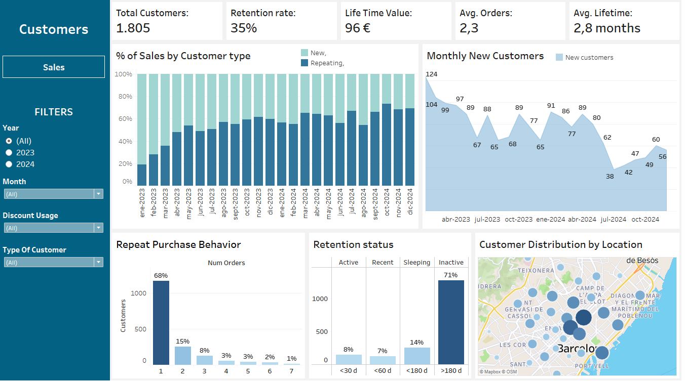
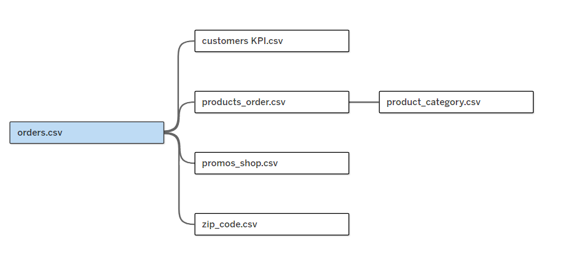

# 📊 Restaurant Sales & Customer Intelligence Dashboard
**Interactive Tableau Dashboard**

Built to give a restaurant owner complete visibility into business performance—something the Last App delivery platform couldn't provide with its basic reporting tools.

Before this dashboard, the owner could only see total revenue and order count. Now they can track trends, compare promotions, analyze customer retention, and identify geographic opportunities—all in under 2 minutes.

👉 **[Explore the live dashboard on Tableau Public](https://public.tableau.com/app/profile/vincenzo.di.sario/viz/RestaurantShopDashboard/CustomersDashboard)**

---

## 🎯 The Problem

The restaurant operates exclusively through **Last App** delivery platform, which provides:
- ✅ Total revenue and order count
- ❌ No trend analysis
- ❌ No customer segmentation
- ❌ No promo performance comparison
- ❌ No geographic insights
- ❌ No retention metrics

**Management questions that couldn't be answered:**
- Are sales growing or declining month-over-month?
- Which hours and days generate the most revenue?
- Are promotions profitable or cannibalizing margins?
- How many customers return after their first order? 
- Which neighborhoods should we target for marketing?

---

## 📸 Dashboard Overview

The dashboard provides two complementary views accessible via navigation toggle.

### **Sales View** - Operational Performance


**Top KPIs** provide at-a-glance business health: Total Sales (€172.7K), Avg Ticket (€41.3), Total Orders (4,184), Total Discounts (€36.8K / 17.6% of gross).

**Key features:**
- **Dynamic metric selector** - Switch between Sales, Orders, Avg Ticket, or Avg Discount on the trend chart and heatmap to avoid visual clutter
- **Sales monthly trend** - Spot seasonal patterns and growth trajectory
- **Day × Hour heatmap** - Identify peak business periods at a glance (darker blue = higher performance)
- **Promo performance table** - Compare ROI of monthly campaigns (usage %, revenue impact, avg ticket)
- **Order value distribution** - Understand customer spending patterns (histogram in €5 bins)
- **Product ranking** - Category-level revenue contribution with quantities sold

---

### **Customer View** - Retention & Acquisition


**Top KPIs** focus on customer health: Total Customers (1,805), Retention Rate (35%), Lifetime Value (€96), Avg Orders per Customer (2.3), Avg Lifetime (2.8 months).

**Key features:**
- **New vs. Repeating composition** - Monthly breakdown showing customer type mix (100% stacked bars)
- **Customer acquisition trend** - New customers per month (area) + cumulative base growth (line)
- **Repeat purchase behavior** - Histogram showing drop-off after 1st order (78% one-timers)
- **Retention status** - Distribution across Active/Recent/Sleeping/Inactive segments
- **Geographic heat map** - Sales concentration by Barcelona neighborhood (bubble size = revenue)

---

## 🎨 Design Decisions

### Layout Philosophy
**Top-to-bottom priority hierarchy:**
1. **KPI cards** - Most important metrics for quick business health check
2. **Trend charts** - Time-based analysis comes first (sales/customer growth)
3. **Segmentation charts** - Deeper dives into patterns (heatmaps, distributions, rankings)

This structure mirrors how the restaurant owner reviews performance: "Are we doing well overall?" → "What's the trend?" → "Where specifically should I focus?"

### Interactivity
- **Navigation toggle** (Sales ↔ Customers) - Keeps all analysis in one dashboard instead of forcing users to switch between multiple files
- **Metric selector** - One chart adapts to 4 different metrics, reducing cognitive load
- **Left-aligned filters** - Grouped for easy access while keeping main visual area clean
- **Tooltips** - Detailed breakdowns on hover without cluttering the view

### Color Choices
- **Sales view (blue)** - Professional, financial, trust-oriented
- **Customer view (green)** - Growth, retention, lifetime value-focused
- **Heatmaps (sequential blue)** - Darker = higher performance (intuitive)
- **Stacked bars (blue/light blue)** - Clear contrast between customer types

### Chart Type Rationale

| Visual | Why This Type? |
|--------|----------------|
| **Line chart** | Best for time-series trends (easy to spot growth/decline) |
| **Heatmap** | Reveals patterns across two dimensions (day × hour) at a glance |
| **Histogram** | Shows distribution shape (order value, repeat purchases) |
| **100% stacked bars** | Compares proportions over time (new vs. returning %) |
| **Area + line combo** | Distinguishes cumulative (area) vs. incremental (line) trends |
| **Geographic map** | Immediate spatial understanding for targeting decisions |

---

## 📊 Features & Metrics

### Sales View

**KPI Cards:**
- Total Sales (€)
- Total Orders
- Avg Ticket (€)
- Total Discount (€ and % of gross total)

**Interactive Charts:**
- **Monthly trend** (line) - Selectable metric: Sales | Orders | Avg Ticket | Avg Discount
- **Day × Hour heatmap** - Same metric selector, reveals peak business periods
- **Order value distribution** (histogram) - €5 bins from €10 to €75+
- **Promo performance table** - Count, % adoption, revenue, avg monthly revenue, avg ticket, avg discount, avg orders
- **Product ranking** - Top products by revenue with category, quantity, % of total

**Filters:**
- Year (2023, 2024, All)
- Month (dropdown)
- Shift (Morning/Afternoon/Night)
- Discount Usage (Yes/No)
- Weekday (1-7)
- Day Type (Weekday/Weekend)
- Product Name (multi-select)
- Category (multi-select)

---

### Customer View

**KPI Cards:**
- Total Customers
- Retention Rate (% repeating customers)
- Lifetime Value (avg € spent per customer)
- Avg Orders per Customer
- Avg Customer Lifetime (months between first and last order)

**Interactive Charts:**
- **% of Sales by Customer Type** (100% stacked bars) - New vs. Repeating monthly composition
- **Monthly New Customers** (area + line) - Incremental new customers + cumulative base
- **Repeat Purchase Behavior** (histogram) - Distribution of customers by number of orders (1-6+)
- **Retention Status** (bar chart) - Customer count by Active/Recent/Sleeping/Inactive
- **Customer Distribution by Location** (map) - Sales by Barcelona neighborhood (bubble size)

**Filters:**
- Year (2023, 2024, All)
- Month (dropdown)
- Shift (Morning/Afternoon/Night)
- Discount Usage (Yes/No)
- Day Type (Weekday/Weekend)
- Type of Customer (New/Repeating)

---

## 🔧 Technical Implementation

### Data Source
**SQL Server views exported to CSV** for Tableau Public compatibility:
- `orders.csv` - Enriched transaction data (4,184 records)
- `customers_kpi.csv` - Aggregated customer metrics (1,805 records)

**Note:** Dashboard displays historical data (2023-2024 period). Not real-time due to Tableau Public's CSV-only limitation.

### Data Model Structure

The dashboard connects to 5 CSV files exported from SQL Server:


*Table relationships as configured in Tableau Relationships pane*

**Join logic:**
- **orders.csv** (primary fact table) connects to:
  - `customers_kpi.csv` → via `customer_id`
  - `zip_code.csv` → via `zip_code`  
  - `promos_shop.csv` → via `first_day_month`
  - `products_order.csv` → via `invoice_no`
    - Which then joins to `product_category.csv` via `product_id`

**Note:** These CSVs were exported from the SQL views created in [Project 1](../01_data_cleaning_pipeline/). For detailed table schemas and SQL definitions, see the [Data Model documentation](../01_data_cleaning_pipeline/README.md#data-model).

### Tableau Techniques Used

**Calculated Fields:**
```
// Monthly aggregations using LOD expressions
Monthly Sales: { FIXED [First Day Month] : SUM([Total]) }
Monthly Orders: { FIXED [First Day Month] : COUNT([Invoice No]) }

// Retention rate
Retention Rate: 
  SUM(IF [Type Of Customer] = "Repeating" THEN 1 ELSE 0 END) / 
  COUNT([Customer Id])

// Discount percentage
Discount %: SUM([Discounts Applied]) / SUM([Gross Total])
```

**Parameters:**
- Metric Selector (Sales, Orders, Avg Ticket, Avg Discount) - Used in dynamic titles and chart switching

**Dashboard Actions:**
- Navigation button using container/worksheet toggle
- Filter actions from map to other visuals
- Tooltip detail pop-ups

**Design Specifications:**
- Layout: 1350×850 px (optimized for laptop screens)
- Fonts: Tableau Default (clean, readable)
- Color palette: Blue (#005F7F) for sales, Green (#0A8754) for customers
- Mobile: Dashboard fits tablet landscape mode

---

## 🎯 Key Business Questions Answered

### Sales Analytics
✅ How are revenue and orders trending month-over-month?  
✅ Which days and hours generate the highest sales?  
✅ Are promotions driving volume without destroying margins?  
✅ What's the typical order value distribution?  
✅ Which products contribute most to revenue?  

### Customer Analytics
✅ What percentage of customers return after their first purchase?  
✅ How much does an average customer spend over their lifetime?  
✅ How many orders do customers place before dropping off?  
✅ What's the retention health (active vs. inactive split)?  
✅ Which neighborhoods have the highest customer concentration?  

---

## 🔗 Explore the Dashboard

👉 **[Open the live dashboard on Tableau Public](https://public.tableau.com/app/profile/vincenzo.di.sario/viz/RestaurantShopDashboard/CustomersDashboard)**

### How to Use:
1. **Start with the overview** - Check top KPIs for business health
2. **Explore trends** - Use the metric selector to switch between Sales/Orders/Avg Ticket/Avg Discount
3. **Identify patterns** - Hover over heatmaps to find peak business hours
4. **Filter for specifics** - Use left panel to drill into time periods, shifts, or customer types
5. **Switch views** - Click the navigation button to toggle between Sales and Customer analytics

**Pro tip:** Start with full date range (All years) to see the complete picture, then filter to specific months to investigate anomalies.

---

## 📦 Project Context

This dashboard is **Project 3** of a three-part restaurant analytics pipeline:

1. **[Data Cleaning & Transformation](../01_data_cleaning_pipeline/)** (Excel + Python + SQL)  
   Transformed 4,184 messy orders into analysis-ready datasets

2. **[SQL Insight Story + Power BI](../02_sales_intelligence_analysis/)** (SQL + Power BI)  
   Exploratory analysis highlighting key business insights and recommendations

3. **[Interactive Dashboard](../03_interactive_bi_dashboard)** (Tableau) ← **You are here**  
   Self-service analytics tool for ongoing performance monitoring

**Data flow:**
```
Raw exports → Excel cleaning → Python parsing → SQL modeling → CSV export → Tableau dashboard
```

The SQL views (`orders`, `customers_kpi`) created in Project 1 feed directly into this visualization layer.

---

## 📁 Repository Contents

```
03_tableau_dashboard/
├── screenshots/
│   ├── sales_dashboard.png           ← Sales view screenshot
│   └── customers_dashboard.png       ← Customer view screenshot
│   └── tableau_data_model.png       ← Data Model Structure
├── Restaurant_Shop_Dashboard.twbx    ← Tableau workbook file
└── README.md                         ← This file
```

**Note:** Data files (CSVs) are not included in the repository due to customer privacy. The Tableau Public link contains embedded sample data for exploration.


---


## 📧 Questions?

For details on how the data was prepared, see:
- [Data Cleaning Pipeline Documentation](../01_data_cleaning_pipeline/README.md)
- [SQL View Definitions](../01_data_cleaning_pipeline/SQL/01_views.sql)

For business insights derived from this data, see:
- [SQL + Power BI Insight Story](../02_sales_intelligence_analysis/README.md)
