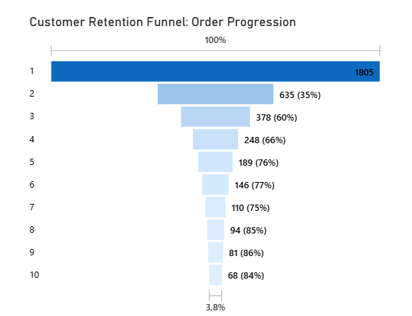
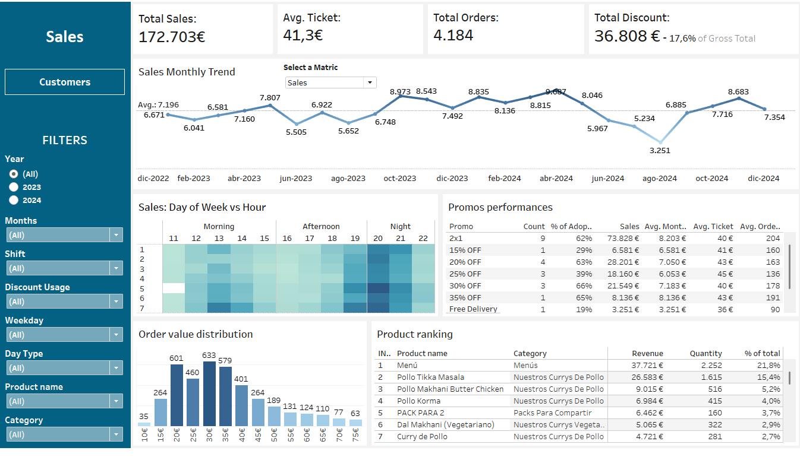

# 🍽️ Restaurant Delivery Analytics
**Turning 4,184 messy orders into €25K+ actionable insights**

---

## 💡 The Impact Story

A Barcelona restaurant was **losing €40K annually** to first-order churn (65% never returned) and **wasting €11.7K on ineffective discounting**—but didn't know it. Their delivery platform (Last App) only showed total sales, no customer behavior.

**I built an end-to-end analytics pipeline** to uncover the retention crisis, quantify margin erosion, and deliver 4 high-ROI recommendations estimated at **€25-30K annual value**.

| Finding | Business Impact | Recommended Fix |
|---------|-----------------|-----------------|
| **65% first-order churn** | €40K lost LTV annually | Milestone loyalty (50% off after 5 orders) |
| **17.6% discount rate** | €11.7K margin erosion | Make SXGY promos permanent |
| **1,537 dormant customers** | €147K inactive LTV | Email/SMS reactivation (5% = €7.4K) |

**Skills demonstrated:** SQL cohort analysis, Python regex parsing, Tableau dashboards, data storytelling

---

## 🎯 Quick Navigation

**Want the headline?** → [3-minute Executive Summary](02_sales_intelligence_analysis/README.md#executive-summary)  
**Visual person?** → [Live Tableau Dashboard](https://public.tableau.com/app/profile/vincenzo.di.sario/viz/RestaurantShopDashboard/CustomersDashboard)  
**Technical reviewer?** → [SQL queries](02_sales_intelligence_analysis/SQL/) + [Python parser](01_data_cleaning_pipeline/Python/)  
**Hiring manager?** → Keep reading (2 more minutes)

---

## 📊 The Three Projects

### 1️⃣ Data Cleaning Pipeline: Messy → Analysis-Ready
## 📸 Visual Proof

### Data Cleaning Transformation

<table>
<tr>
<td width="60%">

**Before: Messy Product Text**

*All items concatenated in one cell with modifiers and packs*

</td>
<td width="40%">

**After: Clean Tabular Format**

*One product per row with quantities extracted*

</td>
</tr>
</table>

**The Mess:**
- All products in one unstructured text field: `"1x PACK PARA 2: 1x Tikka*, 2x Coke..."`
- Customer PII exposed (phones, emails, addresses)
- 12.5% revenue reconciliation gap

**The Fix:**
- Python regex to parse 4,184 nested product strings
- Excel Flash Fill for ZIP extraction + PII anonymization
- SQL views with defensive NULL handling for KPIs

**The Result:**
- `orders` table (4,184 rows) with temporal, geographic, financial features
- `customers_kpi` table (1,805 customers) with retention status, LTV, frequency
- 87.5% revenue reconciliation (documented limitations)

→ [See the technical breakdown](01_data_cleaning_pipeline\)

---

### 2️⃣ SQL Analysis: €25K Opportunity Uncovered

**The Investigation:**
- 19 SQL queries exploring retention, discounting, operations
- Window functions for customer lifecycle cohorts
- Promotional ROI comparison across 7 discount types

**The Findings:**
- 🔴 **65% first-order churn** (vs 30-40% industry benchmark)
- 🔴 **€11.7K annual margin erosion** (17.6% discount rate vs 10-12% healthy)
- 🟢 **SXGY promos outperform 3:1** (€44-47 AOV with 14-18% discount)

**The Deliverable:**
- 4 prioritized recommendations with estimated ROI
- Financial Impact Summary quantifying all opportunities
- Strategic implementation roadmap

→ [Read the full analysis](02_sales_intelligence_analysis/)

---

### 3️⃣ Tableau Dashboard: Self-Service Analytics

**The Need:**
Last App's native reporting = total sales + order count only. No trends, no segmentation, no retention metrics.

**The Solution:**
Interactive dashboard with:
- Sales trends (monthly, day-part, promo performance)
- Customer health (retention rate, lifetime value, acquisition trends)
- Geographic analysis (Barcelona neighborhood heatmap)
- Dynamic filters (year, shift, discount usage, product category)

**The Impact:**
Owner can now answer in 2 minutes:
- "Are sales growing or declining month-over-month?"
- "Which promos drive basket size vs just margin erosion?"
- "How many customers return after first order?"

→ [Explore the live dashboard](https://public.tableau.com/...)

---

## 🛠️ Technical Highlights

**SQL Skills:**
- Window functions (`ROW_NUMBER`, `LEAD`, `LAG`) for customer lifecycle
- CTEs for retention cohort analysis
- Defensive programming (`NULLIF`, `COALESCE`) for zero-division guards
- 19+ exploratory queries documented with business logic

**Python Skills:**
- Regex text parsing for nested product strings
- Pandas for data transformation
- Handling edge cases (truncated cells, special characters)

**Tableau Skills:**
- LOD expressions for dynamic KPI calculations
- Parameters for metric switching (Sales → Orders → Avg Ticket)
- Dashboard actions for filtering across views
- Geographic visualization (Barcelona neighborhoods)

**Data Quality:**
- Revenue reconciliation validation (87.5% match)
- Documented limitations (product truncation, platform gaps)
- Transparent about what the data CAN'T answer

---

## 👤 About Me

**Vincenzo Di Sario** | Data Analyst  
📍 Barcelona, Spain

**I specialize in:** Turning messy business data into executive-ready insights

**My approach:**
1. **Clean ruthlessly** – Bad data = bad decisions
2. **Question everything** – Why does this metric matter to the business?
3. **Visualize clearly** – If stakeholders squint, I failed

**What I'm looking for:**
- Junior Data Analyst role in Barcelona (or remote EU)
- Companies that value curiosity, clear communication, and data storytelling
- Teams where I can learn from senior analysts while contributing immediately

**Tech stack:** SQL, Python (Pandas), Tableau, Power BI, Excel  
**Currently learning:** dbt, Snowflake, advanced statistical modeling

---

## 📧 Let's Connect

💼 **[LinkedIn](www.linkedin.com/in/vdisario)**  
📧 **[vin.disario@gmail.com](mailto:vin.disario@gmail.com)**  
📊 **[Tableau Public Profile](https://public.tableau.com/app/profile/vincenzo.di.sario)**

**Open to:** Full-time junior analyst roles, contract projects, portfolio feedback

---

## 📝 Project Notes

**Data Privacy:** All customer data anonymized. Sample datasets for demonstration only.

**Want to replicate this analysis?**
1. Start with [Data Cleaning Pipeline](01_data_cleaning_pipeline/) (setup instructions)
2. Review [SQL queries](02_sales_intelligence_analysis/SQL/) (copy-paste ready)
3. Download [Tableau workbook](03_interactive_bi_dashboard/) (pre-connected to sample data)

**Feedback welcome!** If you spot analytical gaps, data quality issues, or have suggestions for improvement, please reach out. I'm always learning.

---

**Last Updated:** December 2024